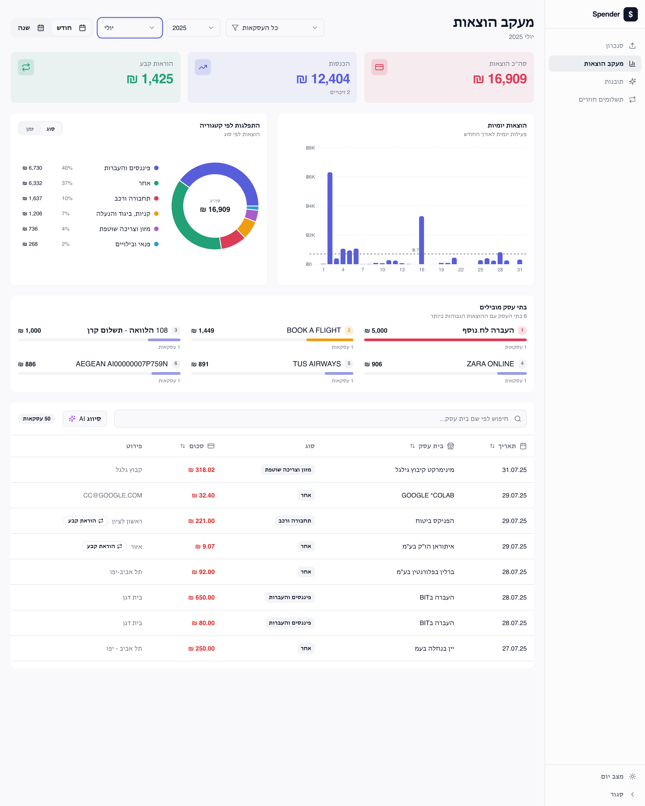

# spender

A Hebrew/RTL personal-spending dashboard ("בזבזני") that ingests Israeli credit-card statement CSVs and produces totals, category breakdowns, standing orders, installments, recurring payments, and monthly AI insights.



## Stack

- **Client** — Vite + React 18 + TypeScript + shadcn/ui + Tailwind + Recharts
- **Server** — Express 5 + multer (uploaded CSVs persist under `server/data/`)
- **AI (optional)** — Google Gemini for category labeling and streaming monthly insights

## Run locally

Requires Node.js (use [nvm](https://github.com/nvm-sh/nvm#installing-and-updating) if you need to install it).

```sh
git clone https://github.com/amitedenzon/spender.git
cd spender
npm i
npm run dev
```

The app is at http://localhost:5173. Vite proxies `/api/*` to the Express server on port 3001, so always go through 5173.

To enable Gemini-backed features (AI categorization + monthly insights), drop your key into `GEMINI_API_KEY.txt` at the repo root — it is read server-side and never shipped to the client.

## Commands

- `npm run dev` — Express API + Vite client, concurrently
- `npm run server` — API only
- `npm run build` / `npm run build:dev` — production / dev-mode Vite build into `dist/`
- `npm run lint` — ESLint (flat config)
- `./launch_app.sh` — build & run the Dockerfile with live-reload mounts on ports 3001 and 5173

## What it does

- **Upload** — drop one or more Hebrew Isracard-style CSVs; re-uploading overwrites by filename.
- **Dashboard** — monthly/yearly totals, category pies, top merchants, weekly patterns, income vs. spending.
- **Insights** — streamed Gemini cards (headline + 4–6 short Hebrew takes) for the latest statement period.
- **Recurring payments** — surfaces standing orders, installments, and merchants that bill in ≥3 months with stable amounts.
- **Data management** — list/download/delete uploaded CSVs.

Category overrides are stored in `localStorage` under `category_overrides` and reapplied on every load.
